<div align="center">


# 🍕 ZaHub

**El algoritmo del antojo perfecto** — sistema para una pizzería: app para clientes y panel de administración.

[](https://cabrales16.github.io/ZaHub/)


| App cliente | Panel admin |
|:---:|:---:|
| 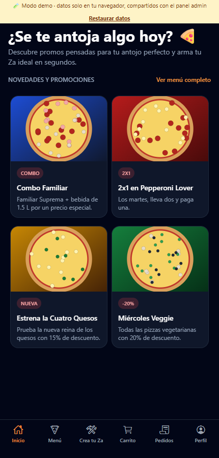 | 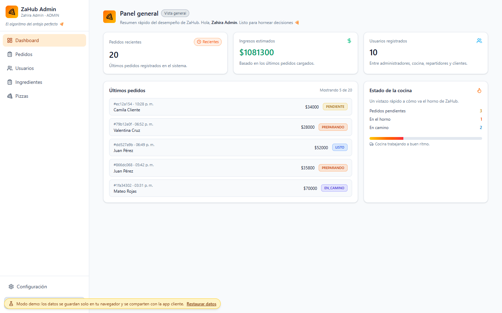 |

</div>

---

## 📑 Contenido

- [Qué es](#-qué-es)
- [Demo en vivo](#-demo-en-vivo)
- [Galería](#-galería)
- [Estructura del repositorio](#-estructura-del-repositorio)
- [Cómo funciona la demo](#-cómo-funciona-la-demo)
- [Ejecutar en local](#-ejecutar-en-local)
- [Conectar con Supabase real](#-conectar-con-supabase-real)
- [Despliegue](#-despliegue)
- [Mejoras y correcciones](#-mejoras-y-correcciones)

## 🍕 Qué es

ZaHub nació como dos proyectos separados (`ZaHub-Cliente` y `ZaHub-Admin`) que comparten el mismo backend en Supabase. Aquí viven juntos:

| Módulo | Para quién | Tecnología | Funciones |
|---|---|---|---|
| [`cliente/`](cliente/) | Clientes | Expo + React Native + NativeWind (iOS, Android y web) | Promociones, menú, **Crea tu Za** (tamaño, masa, borde e ingredientes), carrito, confirmación de pedido y **seguimiento de pedidos** |
| [`admin/`](admin/) | Equipo (admin, cajero, cocina) | React 19 + Vite + Tailwind 4 | Dashboard, pedidos con cambio de estado e historial, catálogo de pizzas, ingredientes, usuarios y roles, tema claro/oscuro |

## 🎮 Demo en vivo

👉 **https://cabrales16.github.io/ZaHub/**

No necesita backend: los datos viven en tu navegador y puedes restaurarlos con **«Restaurar datos»**. Las dos apps comparten los mismos datos, así que puedes ver el ciclo completo:

1. Abre la **app cliente**, entra como cliente y haz un pedido (menú → *Agregar al carrito* → *Confirmar pedido*).
2. Abre el **panel admin** en otra pestaña: el pedido aparece como `PENDIENTE`. Pásalo a `HORNEANDO`, `EN_CAMINO`… y revisa su historial.
3. Vuelve a **Pedidos** en la app cliente: verás el nuevo estado.

| Perfil | Correo | Contraseña |
|---|---|---|
| 📱 Cliente | `cliente@zahub.demo` | `demo1234` |
| 🧑‍🍳 Administrador | `admin@zahub.demo` | `demo1234` |
| 💵 Cajero | `cajero@zahub.demo` | `demo1234` |
| 🔥 Cocina | `cocina@zahub.demo` | `demo1234` |

Cada pantalla de inicio de sesión tiene botones de acceso rápido. También puedes registrarte como cliente con tu propio correo.

## 🖼️ Galería

| Inicio | Menú | Detalle |
|:---:|:---:|:---:|
|  | 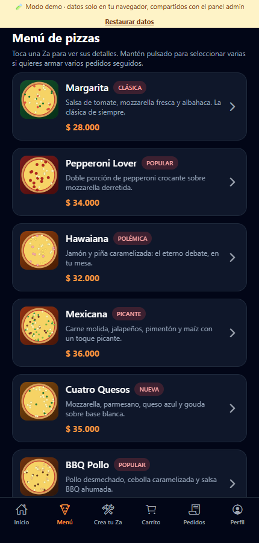 | 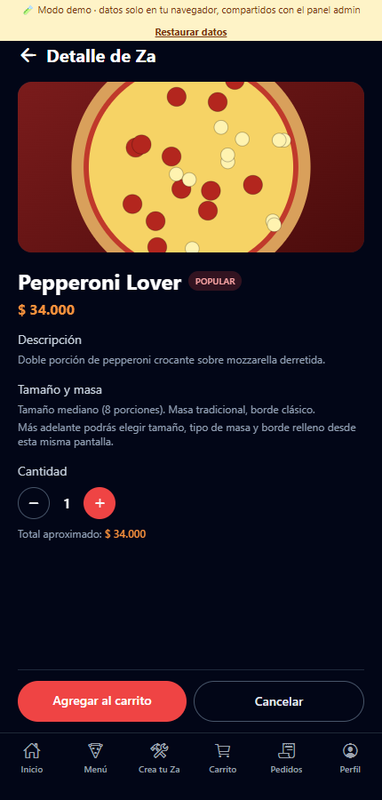 |
| **Crea tu Za** | **Carrito** | **Mis pedidos** |
| 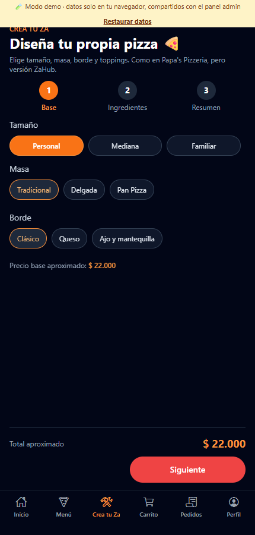 | 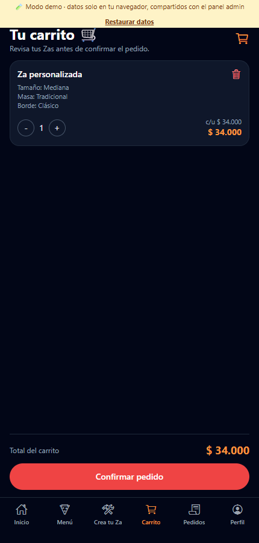 | 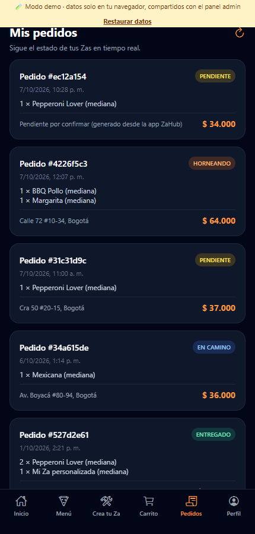 |

| Pedidos (admin) | Detalle de pedido |
|:---:|:---:|
| 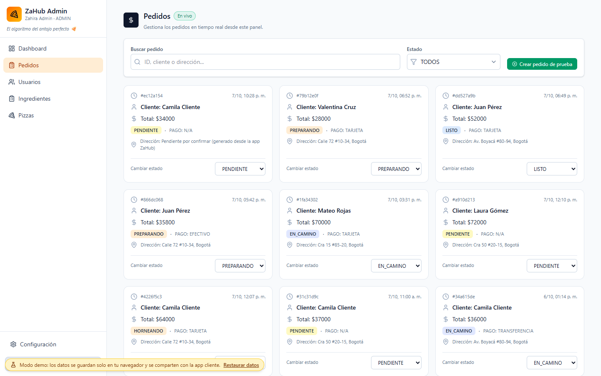 | 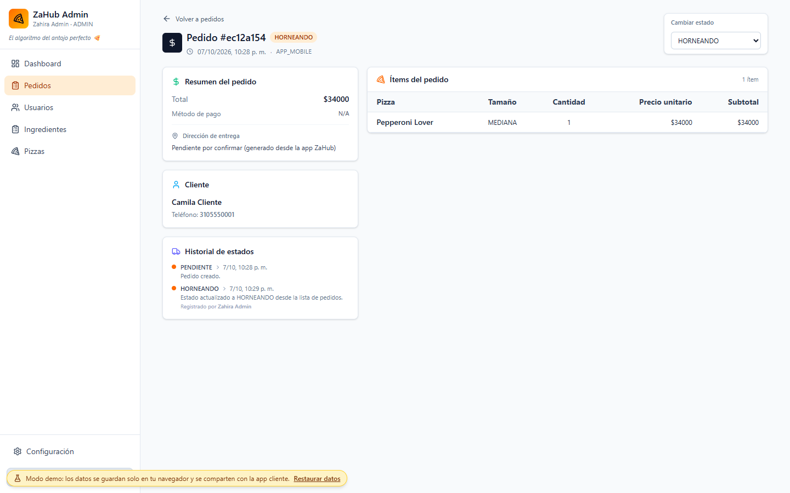 |
| **Pizzas** | **Usuarios** |
| 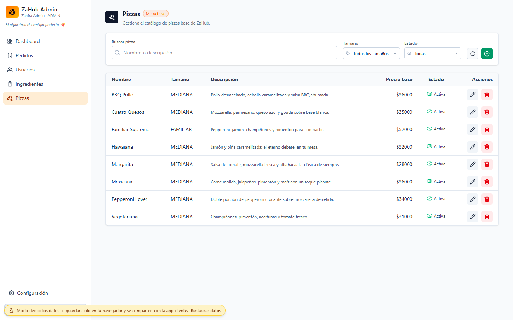 | 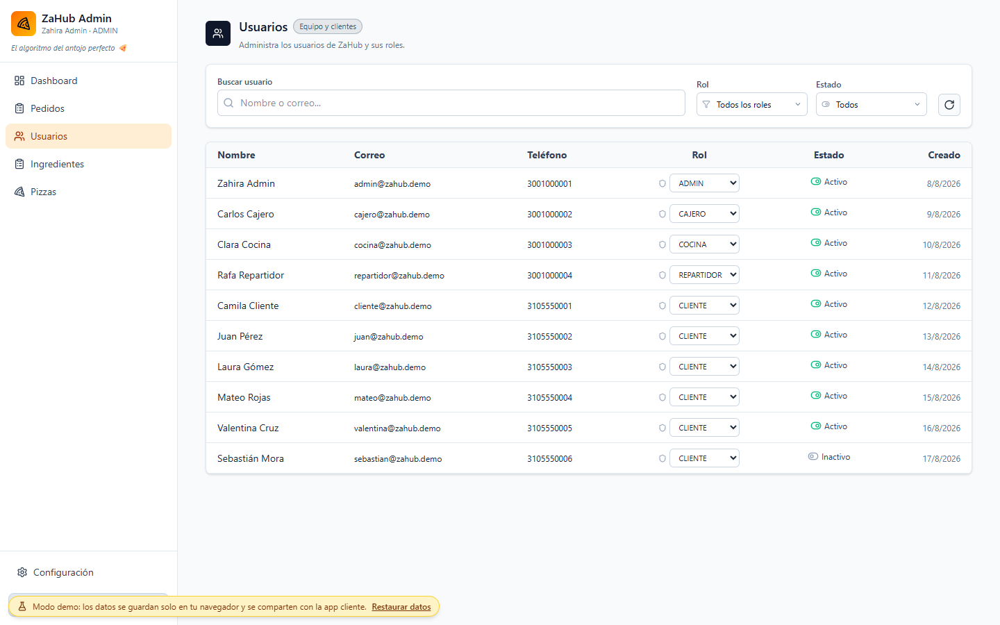 |

## 🗂️ Estructura del repositorio

```
ZaHub/
├── admin/        # Panel web (Vite + React + Tailwind)
├── cliente/      # App móvil/web (Expo Router + NativeWind)
├── shared/mock/  # Backend simulado compartido por las dos apps (demo)
├── landing/      # Página de entrada de la demo
├── docs/         # Capturas
└── .github/workflows/deploy-demo.yml
```

## 🧪 Cómo funciona la demo

Las dos apps hablan con Supabase a través de `supabase-js`. En modo demo ese cliente se sustituye por [`shared/mock/mockSupabase.js`](shared/mock/mockSupabase.js), que implementa el subconjunto de la API que usan (consultas con filtros, orden y relaciones anidadas, inserciones, actualizaciones, borrados y autenticación) sobre `localStorage`.

- Se activa con `VITE_DEMO_MODE=true` (admin) o `EXPO_PUBLIC_DEMO_MODE=true` (cliente); sin esas variables se usa Supabase como siempre.
- Como ambas apps se publican en el mismo origen, **comparten la base de datos** (clave `zahub-demo-db-v1`) pero cada una guarda su propia sesión.
- La carta del cliente (`productos`) se deriva de `pizzas_base`: lo que se edita en el panel se refleja al instante en la app.
- Las imágenes de pizzas y promociones son ilustraciones SVG generadas por código (sin enlaces externos).
- El admin usa `HashRouter` (`#/admin/...`) y la app cliente se exporta como sitio estático, para que funcione en GitHub Pages sin redirecciones.

## 💻 Ejecutar en local

Requisitos: Node.js 20+.

```bash
# Panel admin
cd admin
npm install
npm run dev:demo      # demo sin backend  →  http://localhost:5173/ZaHub/admin/
npm run dev           # contra Supabase (necesita .env)

# App cliente
cd cliente
npm install
npm run web:demo      # demo sin backend, en el navegador
npm start             # contra Supabase (Expo Go / emulador)
```

> Para que admin y cliente compartan datos en local deben servirse desde el mismo origen (como en Pages). En desarrollo cada servidor usa un puerto distinto, así que cada app tendrá su propia copia de los datos.

## 🔌 Conectar con Supabase real

1. Copia `admin/.env.example` a `admin/.env` y `cliente/.env.example` a `cliente/.env`, con la URL y la *anon key* de tu proyecto.
2. Las apps esperan estas tablas: `usuarios_app`, `pizzas_base`, `ingredientes`, `promociones`, `productos`, `carrito_items`, `carrito_item_ingredientes`, `pedidos`, `pedido_items`, `pedido_item_ingredientes` e `historial_estado_pedido`.
3. Activa **Row Level Security** y define políticas por rol: la *anon key* es pública por diseño y no protege los datos por sí sola.

## 🌐 Despliegue

El workflow [`deploy-demo.yml`](.github/workflows/deploy-demo.yml) compila las dos apps en modo demo, arma el sitio (`landing/` + `admin/` + `cliente/`) y lo publica con el pipeline de **Jekyll** de GitHub Pages en cada push a `main`.

1. En el repositorio: **Settings → Pages → Source: GitHub Actions**.
2. Haz push a `main` (o lanza el workflow desde *Actions*).

> Las rutas base (`/ZaHub/admin/` y `/ZaHub/cliente/`) asumen que el repositorio se llama `ZaHub`; si usas otro nombre cámbialas en `admin/vite.config.js` y `cliente/scripts/demo.js`.
> Jekyll ignora las carpetas que empiezan por `_`; `landing/_config.yml` incluye `_expo/`, donde Expo deja su JavaScript.

## 🔧 Mejoras y correcciones

**Seguridad**
- Si el perfil de `usuarios_app` no se podía cargar, el panel **asumía rol ADMIN**: ahora no concede acceso. Además bloquea a los usuarios desactivados.
- La URL y la *anon key* de Supabase estaban escritas en el código del admin y el `.env` del cliente estaba versionado: ahora se leen de variables de entorno (hay `.env.example`) y `.env` está en `.gitignore`.

**Errores corregidos**
- **App cliente**
  - «Agregar al carrito» de una pizza del menú **no hacía nada** (solo un `console.log`): ahora crea la línea de carrito (o suma la cantidad).
  - Tras confirmar un pedido se enviaba a `/(tabs)/orders`, una pantalla que **no existía**: se creó «Mis pedidos» con el estado de cada pedido.
  - `Alert.alert` no funciona en web, así que los avisos y la confirmación del pedido nunca aparecían: se añadió un reemplazo que usa `confirm`/`alert` en web y el Alert nativo en móvil.
- **Panel admin**
  - El detalle de pedido ignoraba el nombre y el tamaño de las **Zas personalizadas** (mostraba siempre «Pizza personalizada»).
  - «Crear pedido de prueba» usaba el UUID de un cliente escrito a mano: ahora toma uno real.
  - Se eliminó `App.jsx` (una plantilla sin usar) y se dejó el lint sin errores.
- **Integración:** el menú del cliente leía `productos` y el panel editaba `pizzas_base`; en la demo ambos están conectados.

## 📄 Licencia

Proyecto con fines educativos.
